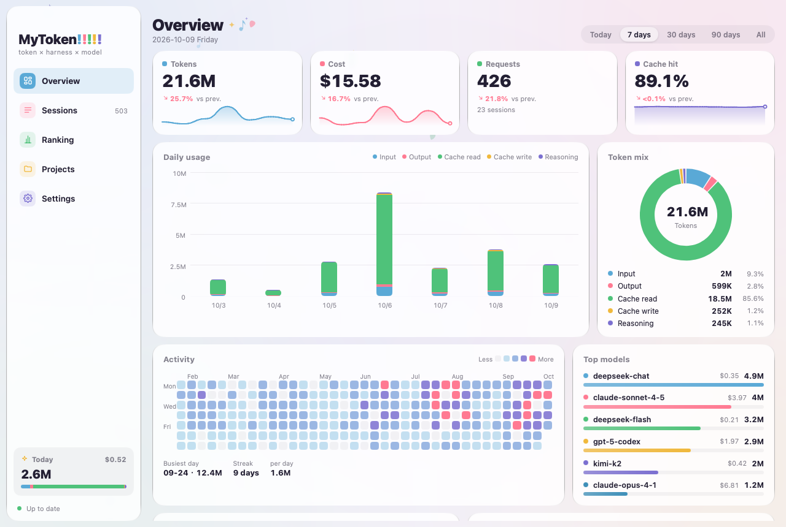
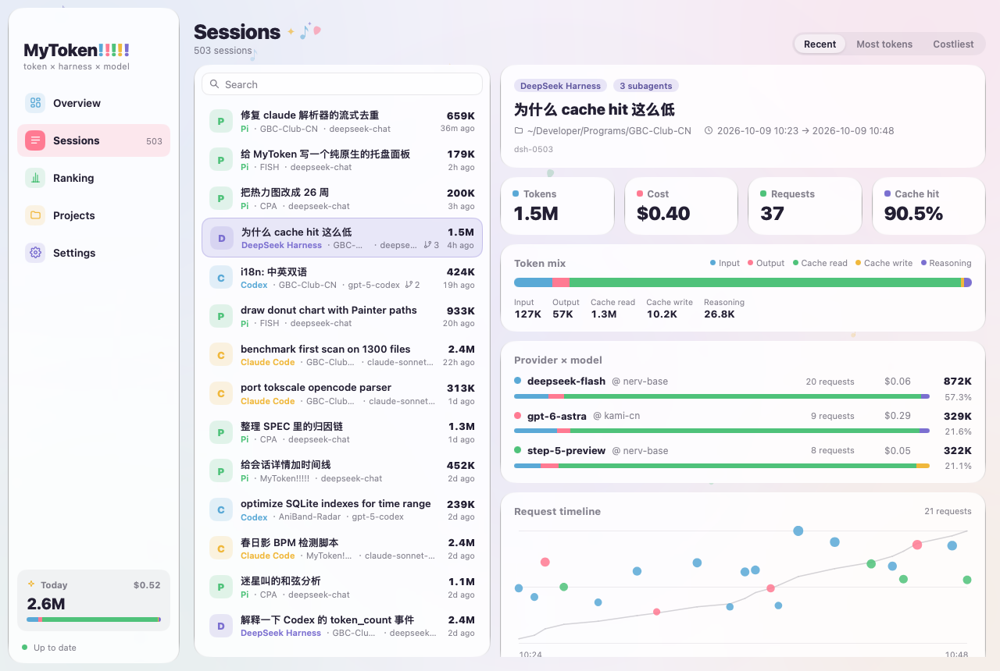
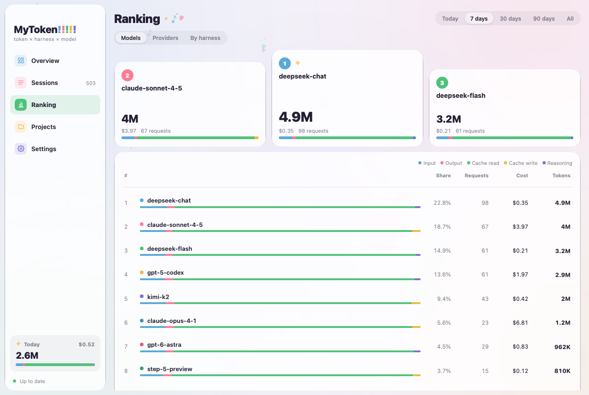
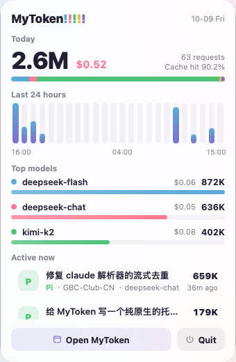
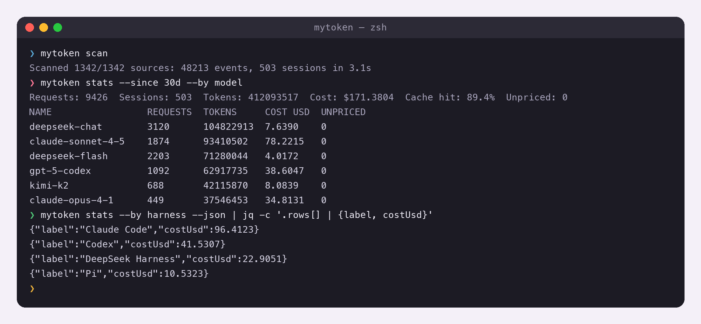
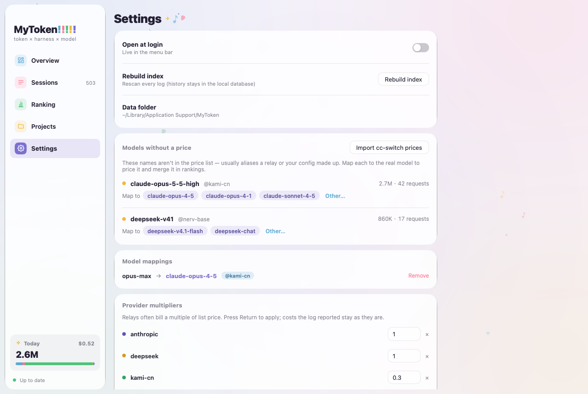

# MyToken!!!!!

[English](README.md) | **简体中文**

**你的 token 都花在哪了？** MyToken!!!!! 读取 AI 编程 harness 已经写在磁盘上的会话日志，把每一次请求归到
会话 × 供应商 × 模型，算出费用，然后在原生桌面应用里展示出来 —— 也可以用命令行直接拿到 JSON。

一切都在你自己的机器上完成。没有账号、没有遥测、没有上传：应用唯一的网络请求就是下载价格表。

- **一个窗口里看十个 harness** —— Claude Code、Codex CLI、DSH、Gemini CLI、opencode、Crush、
  Cline、Roo Code、Kilo Code 和 pi。
- **会话 × 供应商 × 模型** —— 五类 token 分开统计（input、output、cache read、cache write、
  reasoning），同时给出缓存命中率、按项目 / 按天的拆分，以及子代理树。
- **可审计的归因** —— 每个供应商都标注了它是怎么确定的：`log`、`cc-switch`、`config-timeline`、
  `inferred` 或 `user-rule`（见[供应商归因](#供应商归因)）。
- **对得上账单的费用** —— 优先用 models.dev 的价格、LiteLLM 兜底，再叠加按供应商的倍率和按模型的自定义
  单价，订阅套餐和代金券也能算准。
- **托盘常驻** —— 关掉窗口也继续扫描；托盘面板显示今日 token 与费用、最近 24 小时和 Top 模型。
- **命令行可脚本化** —— `mytoken stats --json` 输出的就是应用里看到的同一份数字。
- **原生、小巧、快** —— 基于 [MyGo](https://github.com/egoist/mygo) 的原生 UI 包：没有 Electron、
  没有 WebView、不用 cgo。本机日志全量首扫只需几秒。

## 界面截图

| 概览 | 会话 |
| --- | --- |
|  |  |

| 排行 | 托盘面板 |
| --- | --- |
|  |  |

| 命令行 | 设置 |
| --- | --- |
|  |  |

## 支持的 harness

MyToken!!!!! 读取每个 harness 本来就保留的日志，只读、不回写：索引里只有数字和元数据，唯一的例外是会话
标题（首条用户消息的前 60 个字符）。

| Harness | ID | 日志位置 |
| --- | --- | --- |
| Claude Code | `claude-code` | `~/.claude/projects/**/*.jsonl`（`$CLAUDE_CONFIG_DIR/projects`），以及存在时的 `~/.config/claude/projects` |
| Codex CLI | `codex` | `$CODEX_HOME/sessions` 与 `$CODEX_HOME/archived_sessions`（默认 `~/.codex`） |
| DSH — DeepSeek Harness | `dsh` | `$DSH_HOME/sessions`（默认 `~/.dsh/sessions`） |
| pi | `pi` | `$PI_HOME/agent/sessions`（默认 `~/.pi/agent/sessions`） |
| Gemini CLI | `gemini` | `$GEMINI_CLI_HOME/tmp`（默认 `~/.gemini/tmp`） |
| opencode | `opencode` | `$OPENCODE_DATA_HOME`，否则 `$XDG_DATA_HOME/opencode`，否则 `~/.local/share/opencode` |
| Crush | `crush` | `$CRUSH_GLOBAL_DATA`，否则 `$XDG_DATA_HOME/crush`，否则 `~/.local/share/crush` |
| Cline | `cline` | `…/globalStorage/saoudrizwan.claude-dev/tasks`，以及 `~/.cline/data/tasks` 和 `~/.cline/data/sessions` |
| Roo Code | `roo` | `…/globalStorage/rooveterinaryinc.roo-cline/tasks` |
| Kilo Code | `kilo` | `…/globalStorage/kilocode.kilo-code/tasks` |

VS Code 系扩展的 `…/globalStorage` 会按平台和编辑器解析 —— 编辑器：VS Code、VS Code Insiders、
Cursor、Windsurf、VSCodium、Trae；平台：macOS 是 `~/Library/Application Support/<编辑器>/User/globalStorage`，
Linux 是 `~/.config/<编辑器>/User/globalStorage`（或 `$XDG_CONFIG_HOME/…`），Windows 是
`%APPDATA%\<编辑器>\User\globalStorage`。

每个读取路径都可以改，便于非默认安装、容器和归档日志：

| 环境变量 | 作用 |
| --- | --- |
| `MYTOKEN_HOME` | 索引存放位置（所有平台） |
| `CLAUDE_CONFIG_DIR` | 用该目录替代 `~/.claude` 作为 Claude Code 配置目录 |
| `CODEX_HOME` | 用该目录替代 `~/.codex` 作为 Codex 数据目录 |
| `DSH_HOME` | 用该目录替代 `~/.dsh` 作为 DSH 数据目录 |
| `PI_HOME` | 用该目录替代 `~/.pi` 作为 pi 数据目录 |
| `GEMINI_CLI_HOME` | 用该目录替代 `~/.gemini` 作为 Gemini CLI 数据目录 |
| `MYTOKEN_GEMINI_DIRS` | 直接指定 Gemini CLI 日志目录（路径列表） |
| `OPENCODE_DATA_HOME` | opencode 数据目录 |
| `MYTOKEN_OPENCODE_DIRS` | 直接指定 opencode 目录（路径列表） |
| `CRUSH_GLOBAL_DATA` | Crush 数据目录 |
| `MYTOKEN_CRUSH_DIRS` | 直接指定 Crush 目录（路径列表） |
| `CLINE_DIR`、`CLINE_DATA_DIR`、`CLINE_SESSION_DATA_DIR` | Cline 数据目录 |
| `MYTOKEN_CLINE_DIRS`、`MYTOKEN_ROO_DIRS`、`MYTOKEN_KILO_DIRS` | 直接指定 Cline / Roo / Kilo 目录（路径列表） |

## 供应商归因

日志里往往不会写明这次请求走的是哪个账号或网关，所以供应商由一条优先级链推断，应用会告诉你答案是哪一步
给出的：

1. **`log`** —— harness 自己记录了供应商。
2. **`cc-switch`** —— 与只读打开的 `~/.cc-switch/cc-switch.db` 请求日志匹配（app type、模型、token
   相同，时间窗 ±120 秒）。
3. **`config-timeline`** —— 按请求发生时刻 `~/.claude/settings.json` 或 `~/.codex/config.toml` 里的
   base URL 时间线判定。
4. **`inferred`** —— 从模型名推断（`claude-*` → Anthropic，`gpt-*`/`o*` → OpenAI，`gemini-*` →
   Google，`deepseek-*` → DeepSeek……）。界面上标为“推断”，不当作事实。
5. **`user-rule`** —— 你自己定义的规则，覆盖以上全部。

## 费用

- 价格来自 [models.dev](https://models.dev)，兜底用 LiteLLM 的
  [`model_prices_and_context_window.json`](https://github.com/BerriAI/litellm)，并内置一份离线快照供首次
  运行使用。价格表在磁盘上缓存 24 小时，用缓存也能完全离线工作。
- 五类 token 分别计价；价格表里没有 reasoning 单价时按 output 单价计算。
- 按供应商的倍率和按模型的自定义单价可以覆盖订阅套餐、代金券和议价；也可以从 cc-switch 导入价格
  （`model_pricing`、`providers.cost_multiplier`）。
- **模型映射。** 中转站或你自己的配置编出来的模型名在任何价格表里都查不到，应用会把它们列成 *unpriced*
  而不是瞎猜。在*设置 → 模型映射*里把每个名字映射到真实模型（可选指定供应商），之后这些请求就会被正常计价
  并合并进排行。
- 日志自带的费用永远优先于计算值；找不到价格的请求会明确标成 *unpriced*，而不是悄悄算成 0。

## 隐私

- **纯本地。** 索引、价格缓存和设置都不会离开你的机器。没有遥测、没有统计、没有崩溃上报、没有账号、没有同步。
- **只有一个网络请求。** 下载价格表（先 models.dev，再 LiteLLM），仅此而已。有缓存或内置快照时，应用一个请求都不发。
- **只读读取器。** harness 日志只以只读方式打开；索引是独立的 SQLite 文件，随时可以删掉重来。
- **不存对话内容。** 只存数字和元数据，唯一例外是会话标题：首条用户消息的前 60 个字符，只为让会话列表可读。

| 平台 | 索引目录 |
| --- | --- |
| macOS | `~/Library/Application Support/MyToken` |
| Windows | `%APPDATA%\MyToken` |
| Linux | `$XDG_DATA_HOME/mytoken`（通常是 `~/.local/share/mytoken`） |

数据库是目录里的 `mytoken.db`。用 `MYTOKEN_HOME` 可以放到别处（比如拿一份临时索引试玩）；删掉整个目录
即可重置。

## 安装

### macOS（磁盘映像）

从 [Releases](../../releases) 下载 `mytoken <版本>.dmg`，打开后把 **MyToken!!!!!** 拖进
*应用程序*。这个 bundle 是 ad-hoc 签名、未公证的，所以第一次启动需要右键 → *打开*（或者执行
`xattr -dr com.apple.quarantine /Applications/mytoken.app`）。应用文件名是 `mytoken.app`，Finder
和菜单栏显示 `MyToken!!!!!`。

### Windows（安装包）

下载 `mytoken Setup <版本>.exe` 并运行。安装包未签名，首次运行 SmartScreen 会要求 *更多信息* →
*仍要运行*。它会安装 `mytoken.exe`、开始菜单项和卸载程序。

### Linux（安装脚本）

```sh
curl -fsSL https://github.com/zzstar/mytoken/releases/latest/download/install.sh | sh
```

按用户安装，不需要 root：应用放在 `~/.local/mytoken.app`，`mytoken` 命令放在 `~/.local/bin`，并写入
应用菜单项。`sh install.sh --uninstall` 卸载并保留数据。

### Linux（Debian 包）

```sh
sudo apt install ./mytoken_<版本>_amd64.deb
```

安装到 `/opt/mytoken`，同时提供 `/usr/bin/mytoken` 命令和桌面项。依赖 GTK 3、WebKitGTK 4.1 和
libayatana-appindicator3（托盘图标）。

### 用 Go 工具链安装

```sh
go install github.com/zzstar/mytoken@latest
```

编译出与发行包相同的二进制（含 CLI），位于 `$(go env GOPATH)/bin/mytoken`。

## 命令行

应用二进制同时也是 CLI：不带参数启动 GUI，带子命令则在终端工作。完整说明见
[docs/CLI.md](docs/CLI.md)。

```sh
mytoken stats                                  # 最近 7 天，按会话
mytoken stats --since 30d --by model           # 最近 30 天，按模型分组
mytoken stats --since 2026-10-01 --by provider # 指定日期起，按供应商分组
mytoken stats --json                           # 机器可读输出
mytoken sessions --limit 20                    # 会话列表，按最近更新排序
mytoken scan                                   # 立刻重新索引
mytoken doctor                                 # 检查数据源、路径与版本
mytoken prices list                            # 当前生效的价格表
mytoken prices set --provider zai --multiplier 0.5
mytoken prices import-ccswitch                 # 导入 cc-switch 的价格
mytoken version
```

`--by` 支持 `session`、`provider`、`model`、`project`、`day`、`harness`；`--since` 支持时长（`7d`、
`30d`）或日期（`YYYY-MM-DD`）。`mytoken help` 会列出所有命令。

## 从源码构建

需要 Go 1.27 或更高版本，且不使用 cgo（`CGO_ENABLED=0` —— SQLite 驱动是纯 Go 的）。运行应用需要
macOS 12+、Windows 10+，或带 GTK 3 与 WebKitGTK 4.1 的 Linux 桌面。

```sh
git clone https://github.com/zzstar/mytoken
cd mytoken

make build     # 生成 ./mytoken，版本号取自最新的 v* tag
make run       # 直接从源码运行
make check     # gofmt 检查、go vet、go test
```

`make help` 会列出打包目标：

```sh
make app       # 当前平台
make dmg       # macOS 通用 .app 与 .dmg
make linux     # linux/amd64 + linux/arm64：二进制、.deb、tar 包、install.sh
make windows   # windows/amd64 + windows/arm64（.exe 与安装包；需要 makensis）
```

它们都是对 `go tool mygo build -platform …` 的封装。[MyGo](https://github.com/egoist/mygo) 通过
`go.mod` 的 `tool` 指令固定版本，无需全局安装；它的打包元数据在 [mygo.json](mygo.json) —— 标识符、
图标、macOS 显示名、Linux 桌面项。注意 MyGo 会用 `name`（`mytoken`）来命名 bundle 和可执行文件，这样
CLI 命令和产物文件名在 shell 里更友好；macOS 的显示名通过 `CFBundleDisplayName` 设回 `MyToken!!!!!`。

## 发布

发布从 tag 开始：

```sh
make bump TAG=v0.2.0   # 把版本号写进 mygo.json（也可以手改）
git commit -am "release v0.2.0"
git tag v0.2.0
git push origin main --tags
```

随后 [.github/workflows/release.yml](.github/workflows/release.yml) 会创建一个 draft release，构建
macOS 通用包、Windows 安装包和 Linux 软件包并挂到该 draft 上；检查无误后手动发布。版本号始终取自
tag，且不需要任何 secret：macOS 包是 ad-hoc 签名，Windows 安装包不签名。签名与公证所需的 secret 写在
workflow 顶部的注释里。

[.github/workflows/ci.yml](.github/workflows/ci.yml) 会在每次 push 和 PR 上，于 macOS、Linux、
Windows 三个平台运行 `go vet` 和 `go test`，并额外做一次 `gofmt` 检查。

## 致谢

- **[tokscale](https://github.com/search?q=tokscale)** —— 多个 harness 的解析规则移植自 tokscale，
  包括 Gemini CLI 的 token 折叠方式和它接受的各种字段名。
- **[MyGo](https://github.com/egoist/mygo)** —— 应用所用的原生 UI 工具包。
- **[models.dev](https://models.dev)** 与 **[LiteLLM](https://github.com/BerriAI/litellm)** —— 价格表来源。
- **cc-switch** —— 价格导入格式，以及归因所使用的供应商请求日志。

## 免责声明

MyToken!!!!! 是对乐队 **MyGO!!!!!** 的非官方同人致敬 —— 名字、配色和界面里的小装饰只是善意的致意。
本项目与乐队、成员及其厂牌没有任何隶属、背书或合作关系，也不内置任何官方素材。相关商标归各自所有者所有。

## 许可

[MIT](LICENSE) © 2026 zzstar101
